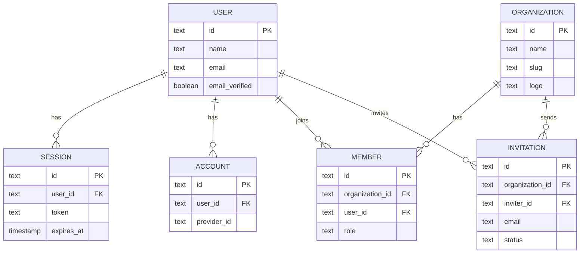
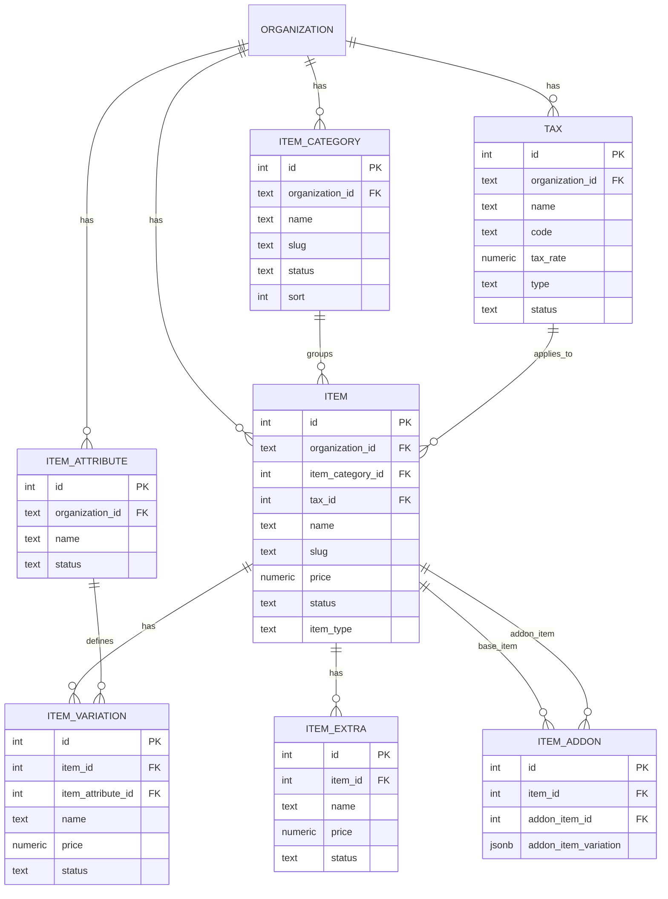

# Database Map

File ini adalah peta baca sederhana untuk model database Restoki.

Cara membaca relasi:

- `A ||--o{ B` artinya satu data A bisa punya banyak data B.
- Kolom dengan akhiran `Id`, seperti `organizationId`, biasanya menunjuk ke tabel lain.
- Di kode Drizzle, relasi terlihat dari `.references(() => tabel.id)`.

## Alur Besar

```txt
user login
  -> user menjadi member organization
    -> organization punya catalog/menu
      -> catalog dipakai untuk order, promo, dan transaksi
```

## Auth dan Organization



## Catalog



## Contoh Data Nyata

```txt
USER
  Budi

ORGANIZATION
  Kopi Mantap

MEMBER
  Budi adalah owner Kopi Mantap

ITEM_CATEGORY
  Kopi
  Snack

ITEM
  Es Kopi Susu, category: Kopi
  Kentang Goreng, category: Snack

ITEM_ATTRIBUTE
  Size

ITEM_VARIATION
  Small untuk Es Kopi Susu
  Large untuk Es Kopi Susu

ITEM_EXTRA
  Extra Shot untuk Es Kopi Susu

ITEM_ADDON
  Es Kopi Susu bisa tambah Kentang Goreng sebagai addon
```

## Urutan Bikin API

Mulai dari yang paling dekat dengan user:

1. Auth: user bisa login.
2. Organization: user tahu dia masuk restoran mana.
3. Category: restoran bisa membuat kategori menu.
4. Item: restoran bisa membuat menu.
5. Tax, attribute, variation, extra, addon: fitur tambahan untuk menu.
6. Order: customer memilih item dari catalog.

